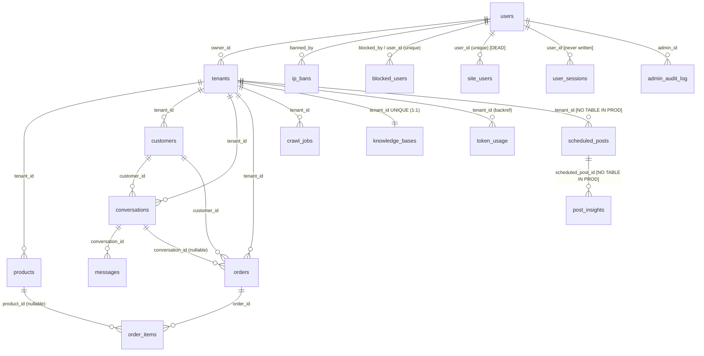

# Z6 — Models & Schemas Deep Analysis (Zemest Backend)

**Task ID:** Z6 · **Scope:** `app/models/*` (13 files), `app/schemas/*` (8 files) · **Method:** line-by-line read of every file, cross-verified against `app/main.py` lifespan DDL, all 3 Alembic migrations, API call sites, admin panel, tests/conftest.py.
**Headline numbers:** **18 SQLAlchemy models / 18 tables** across 12 model modules (+ `__init__.py` re-export) · **28 Pydantic schema classes** across 7 schema modules (+ empty `schemas/__init__.py`).

---

## 1. Complete Data Model Catalog

Common conventions across all models: `Base` from `app/database.py` (plain `DeclarativeBase`, no naming convention, no metadata conventions → constraint names come from explicit args or SQLAlchemy defaults); UUID PKs client-generated via `default=uuid.uuid4` (no server default); timestamps are **naive UTC** (`default=lambda: datetime.utcnow()` — deprecated in Python 3.12, no `DateTime(timezone=True)`, no `server_default`); **no CHECK constraints anywhere**; no soft-delete except `products.is_active` (and inert `tenants.is_active`); no polymorphic models; no `__repr__`/`__str__`; lazy strategy defaults to `select` (lazy loading) everywhere — a known async anti-pattern mitigated only by explicit `selectinload` at some call sites.

### 1.1 `User` — `app/models/user.py` (23 lines) — table `users`
| Column | Type | Null | Default / Constraints |
|---|---|---|---|
| id | UUID | no | PK, default uuid4 |
| fb_user_id | String(64) | yes | **UNIQUE**, index (`ix_users_fb_user_id`) |
| name | String(255) | no | — |
| email | String(255) | yes | **NOT unique, NOT indexed** |
| hashed_password | String(255) | yes | nullable (FB-login users have none) |
| is_superadmin | Boolean | no | default False (column exists only via lifespan DDL — see §5) |
| created_at | DateTime | no | default utcnow (client-side) |

Relationships: `tenants → Tenant` (one-to-many, `back_populates="owner"`, **no cascade** → deleting a User that owns tenants raises FK violation; no endpoint does this today).
Indexes: unique on fb_user_id. **No index on `email`** although login lookups filter on it (seq scan per login).
Properties/methods: none.

### 1.2 `Tenant` — `app/models/tenant.py` (73 lines) — table `tenants` (the multi-tenancy hub)
| Column | Type | Null | Default / Constraints |
|---|---|---|---|
| id | UUID | no | PK, uuid4 |
| fb_page_id | String(64) | yes | **UNIQUE**, indexed — one FB page = one tenant max |
| page_name | String(255) | no | — |
| page_access_token | Text | yes | **plaintext FB token** |
| owner_id | UUID | no | FK → users.id (no index in ORM; index added only by migration `ix_tenants_owner_id`) |
| owner_psid | String(64) | yes | indexed — owner's Messenger PSID routed to owner_chat |
| ig_user_id | String(64) | yes | indexed |
| ig_access_token | Text | yes | **plaintext IG token** |
| wa_phone_number_id | String(64) | yes | indexed |
| wa_access_token | Text | yes | **plaintext WA token** |
| wa_waba_id | String(64) | yes | — |
| website_url | String(512) | yes | — |
| business_phone | String(20) | yes | — |
| business_email | String(255) | yes | — |
| notification_pref | String(20) | no | default "email" (free string, no enum) |
| delivery_inside_cairo | Numeric(10,2) | yes | default Decimal(35) |
| delivery_outside_cairo | Numeric(10,2) | yes | default Decimal(60) |
| free_delivery_above | Numeric(10,2) | yes | — |
| payment_methods | JSON | yes | default None (dict of Vodafone/Instapay/Fawry numbers) |
| style_profile | JSON | yes | default None (learned persona) |
| knowledge_base | JSON | yes | default None (**DEAD COLUMN — never read/written by any code**; real KB lives in `knowledge_bases` table) |
| knowledge_built_at | DateTime | yes | — |
| order_api_config | JSON | yes | default None (external order API creds/config) |
| is_active | Boolean | no | default True (**never checked anywhere** — inert) |
| created_at / updated_at | DateTime | no | utcnow; updated_at onupdate utcnow |

Relationships (all `back_populates`, default lazy `select`):
- `owner → User`
- `products`, `customers`, `conversations`, `orders`, `crawl_jobs` — all `cascade="all, delete-orphan"` (ORM-level only; DB FKs have NO `ondelete`)
- `knowledge_base_rel → KnowledgeBase` (one-to-one, `uselist=False`, **no cascade** — ORM delete of a Tenant with a KB row will attempt to null a NOT NULL FK → IntegrityError)
- **No `token_usages` relationship here** — it is attached from the TokenUsage side via legacy `backref`
- **No relationship to ScheduledPost** despite FK → orphans on delete
Properties/methods: none.

### 1.3 `Customer` — `app/models/customer.py` (37 lines) — table `customers`
`__table_args__`: `UniqueConstraint("tenant_id","fb_psid", name="uq_customer_psid")`.

| Column | Type | Null | Default |
|---|---|---|---|
| id | UUID PK | no | uuid4 |
| tenant_id | UUID | no | FK → tenants.id, indexed |
| fb_psid | String(64) | no | (holds Messenger PSID / IG user id / WA phone — despite the name) |
| channel | String(20) | no | default "messenger" (comment: messenger\|instagram\|whatsapp, not enforced) |
| name | String(255) | yes | — |
| phone | String(20) | yes | not unique (order flow matches on phone) |
| governorate / city / area | String(100) ×3 | yes | Egyptian geo (renamed from BD division/district/upazila by migration a89fe0001) |
| address_detail | Text | yes | — |
| created_at / updated_at | DateTime | no | utcnow / onupdate |

Relationships: `tenant` (back_populates), `conversations` (one-to-many, no cascade), `orders` (one-to-many, no cascade).
Note: uniqueness is `(tenant_id, fb_psid)` — the same human contacting via two channels produces two Customer rows (per-channel identity model); manual orders fabricate `fb_psid = "manual-<uuid4>"` (orders.py:69).

### 1.4 `Conversation` — `app/models/conversation.py` (25 lines) — table `conversations`
| Column | Type | Null | Default |
|---|---|---|---|
| id | UUID PK | no | uuid4 |
| tenant_id | UUID | no | FK → tenants.id, indexed |
| customer_id | UUID | no | FK → customers.id, indexed (**NOT NULL** — style-import passing None → IntegrityError, Z3 finding) |
| channel | String(20) | no | "messenger" |
| status | String(20) | no | "active" (no enum) |
| started_at / last_message_at | DateTime | no | utcnow |

Relationships: `tenant`, `customer`, `messages` (one-to-many, `order_by="Message.created_at"`, **no cascade** → cascading delete from Tenant reaches Conversation, then SQLAlchemy nulls `messages.conversation_id` → NOT NULL violation), `orders` (no cascade).
Composite index `idx_conversations_tenant_status_lastmsg (tenant_id,status,last_message_at)` exists only in migration a89fe0001:188-190 — **not declared in ORM** (autogenerate drift).

### 1.5 `Message` — `app/models/message.py` (27 lines) — table `messages`
`__table_args__`: composite `Index("idx_messages_conversation_created", "conversation_id","created_at")`.

| Column | Type | Null | Default |
|---|---|---|---|
| id | UUID PK | no | uuid4 |
| conversation_id | UUID | no | FK → conversations.id, indexed |
| role | String(10) | no | comment "customer, assistant, system" — not enforced |
| content | Text | no | — |
| channel | String(20) | no | "messenger" |
| media_urls | JSON | yes | None (list) |
| fb_message_id | String(128) | yes | **NO unique constraint, NO index in ORM** — webhook dedup is SELECT-then-insert (race window); migration a89fe0001:152-154 creates only a **plain** index despite docstring line 17 claiming "Makes messages.fb_message_id unique (webhook idempotency)" |
| created_at | DateTime | no | utcnow |

Relationships: `conversation` only.

### 1.6 `Order` — `app/models/order.py` (53 lines) — table `orders`
`__table_args__`: composite `Index("idx_orders_tenant_status","tenant_id","status")`.

| Column | Type | Null | Default / notes |
|---|---|---|---|
| id | UUID PK | no | uuid4 |
| tenant_id | UUID | no | FK, indexed |
| customer_id | UUID | no | FK → customers.id (**not indexed**) |
| conversation_id | UUID | yes | FK → conversations.id (nullable — manual orders) |
| order_number | String(20) | no | **UNIQUE (global, not per-tenant)** — `ORD-YYMMDD-<rand 100-999>` generator collides (Z4) |
| customer_name / customer_phone | String(255)/String(20) | no | denormalized snapshot |
| governorate / city | String(100) | no | denormalized |
| area | String(100) | yes | denormalized |
| address_detail | Text | no | — |
| payment_method | String(30) | no | "cod" |
| payment_phone_last2 | String(10) | yes | **type drift**: ORM/DDL String(10) vs migration a89fe0001:129 String(2) |
| payment_trx_id | String(50) | yes | **drift**: ORM/DDL 50 vs migration String(255) |
| api_status | String(20) | yes | comment success/failed/pending/not_configured; **drift**: migration String(30) |
| api_response | Text | yes | raw external response |
| api_status_code | Integer | yes | — |
| api_called_at | DateTime | yes | — |
| api_external_id | String(100) | yes | **drift**: migration String(255) |
| subtotal / total | Numeric(12,2) | no | — |
| delivery_charge | Numeric(12,2) | no | Decimal("0") |
| status | String(20) | no | "pending"; state machine enforced only in service (order_service.py:116-122) |
| notes | Text | yes | — |
| created_at / updated_at | DateTime | no | utcnow / onupdate |

Relationships: `tenant`, `customer`, `conversation` (no cascades), `items → OrderItem` with `cascade="all, delete-orphan"`.

### 1.7 `OrderItem` — `app/models/order.py:55-66` — table `order_items`
| Column | Type | Null | Notes |
|---|---|---|---|
| id | UUID PK | no | uuid4 |
| order_id | UUID | no | FK → orders.id, indexed |
| product_id | UUID | yes | FK → products.id (**no index in ORM**; migration adds `ix_order_items_product_id`) |
| product_name | String(500) | no | snapshot (hallucinated names allowed at unit_price=0 — Z2) |
| quantity | Integer | no | **no CHECK qty>0** |
| unit_price / total_price | Numeric(12,2) | no | **no CHECK ≥0** |

No tenant_id (indirect scoping through order). Relationship: `order` (back_populates).

### 1.8 `Product` — `app/models/product.py` (56 lines) — table `products`
`__table_args__`: `UniqueConstraint("tenant_id","source","source_ref", name="uq_product_source")` + `Index("idx_products_tenant_active","tenant_id","is_active")`.

| Column | Type | Null | Default |
|---|---|---|---|
| id | UUID PK | no | uuid4 |
| tenant_id | UUID | no | FK, indexed |
| name | String(500) | no | pg_trgm GIN index `idx_products_name_trgm` exists only via migration a89fe0001:196-199, not ORM |
| price | Numeric(12,2) | no | — |
| is_active | Boolean | no | True — soft delete (delete_product sets False, product_service.py:145-147) |
| source | String(20) | no | "manual" (manual/csv/url/crawl) |
| source_ref | String(512) | yes | NULL for manual → PG NULLS-DISTINCT semantics mean **uq_product_source does not dedupe manual products** |
| attributes | JSON | yes | default dict — flexible key-value store (migrated from 9 dropped fixed columns, 927179233531) |
| created_at / updated_at | DateTime | no | utcnow / onupdate |

Relationships: `tenant`. **Method:** `to_dict()` (product.py:43-55) — flattens fixed fields + merges `attributes` at top level; used by knowledge tree sync/agent product context. This is the **only business method on any model in the entire codebase**.

### 1.9 `CrawlJob` — `app/models/crawl_job.py` (27 lines) — table `crawl_jobs`
Columns: id UUID PK; tenant_id FK indexed; url String(1024) not null; status String(20) default "pending"; pages_found Integer default 0; products_extracted Integer default 0; error_message Text nullable; celery_task_id String(255) nullable; started_at / completed_at DateTime nullable; created_at utcnow.
Relationship: `tenant` (Tenant.crawl_jobs cascade all, delete-orphan).

### 1.10 `KnowledgeBase` — `app/models/knowledge_base.py` (26 lines) — table `knowledge_bases`
| Column | Type | Null | Default |
|---|---|---|---|
| id | UUID PK | no | uuid4 |
| tenant_id | UUID | no | FK → tenants.id **UNIQUE** (true 1:1, `UniqueConstraint('tenant_id')` in migration; ORM `unique=True` on mapped_column) |
| tree_json | JSON | no | dict — PageIndex navigation tree (unbounded size) |
| source_documents | JSON | no | list |
| last_indexed_at | DateTime | yes | — |
| created_at / updated_at | DateTime | no | utcnow / onupdate |

Relationship: `tenant` ↔ `Tenant.knowledge_base_rel` (uselist=False, no cascade).
Note: `Tenant.knowledge_base` (JSON column) and this table are **two parallel KB storages — the JSON column is dead**; indexer/retriever/tree_sync use only `knowledge_bases.tree_json`.

### 1.11 `TokenUsage` — `app/models/token_usage.py` (24 lines) — table `token_usage`
Columns: id UUID PK; tenant_id FK indexed; usage_type String(20) not null ("chat"|"crawl"|"knowledge" — comment only); model String(100) not null; prompt_tokens/completion_tokens/total_tokens Integer default 0; created_at utcnow.
Relationship: `tenant = relationship("Tenant", backref="token_usages")` — **the only legacy `backref`** in the codebase (everything else is `back_populates`); attaches `tenant.token_usages` dynamically; no cascade → tenant delete breaks (FK + NOT NULL).
Written from 6 call sites: agent.py:202, agent.py:256, knowledge/indexer.py:166, knowledge/retriever.py:69, api/crawl.py:180, services/owner_chat.py:91.
**Triple authority table** (ORM + lifespan DDL main.py:21-32 + conditional Alembic create a89fe0001:161-177) — the only table defined by all three authorities.

### 1.12 `IPBan` — `app/models/admin.py:14-23` — table `ip_bans`
Columns: id UUID PK; ip_or_cidr String(64) **unique + indexed**; reason Text nullable; banned_by UUID **FK → users.id NOT NULL**; is_active Boolean default True; created_at utcnow.
**Critical drift:** lifespan DDL (main.py:101-107) creates this table **without `is_active`** → every ORM query selecting the column (`select(IPBan).where(IPBan.is_active == True)`, admin/api.py:203, 290) and every INSERT (admin/api.py:243) fails with `UndefinedColumn` on a DDL-created table.

### 1.13 `UserSession` — `app/models/admin.py:26-41` — table `user_sessions`
Columns: id UUID PK; user_id FK users.id indexed; ip_address String(64) indexed; country String(64) nullable; city String(64) nullable; user_agent Text nullable; device_type String(32) nullable; **browser String(64) nullable — NOT in lifespan DDL**; login_at indexed (default utcnow); logout_at nullable; last_activity default utcnow; is_active Boolean default True.
DDL (main.py:112-127) has `country_code`, `latitude`, `longitude` which the ORM **does not map** (silently ignored), and lacks `browser`/`city`… (`city` is present in DDL; `browser` is not).
**Dead-write model:** `UserSession(...)` is never instantiated anywhere — admin analytics (active users, geo distribution, session history: admin/api.py:295-327, 346-348, 428-433) query a table that is forever empty.

### 1.14 `AuditLog` — `app/models/admin.py:44-56` — table `admin_audit_log`
Columns: id **BigInteger PK autoincrement** (only non-UUID PK in the system); admin_id FK users.id indexed; action String(64) not null (free string: user.block, ip.ban, add_ip_ban, admin_login…); target_type String(32) nullable; target_id String(64) nullable; `metadata_` JSON nullable (trailing-underscore workaround for `Base.metadata` collision — column literally named `metadata_`); ip String(64) nullable; **user_agent Text nullable — NOT in lifespan DDL (main.py:136-145)**; created_at indexed.
**Consequence:** the ORM INSERT always includes `user_agent` → on a DDL-created table `_write_audit` (admin_panel.py:116-140, best-effort try/except) **silently fails**, and `_write_audit_log` in the admin REST API (admin/api.py:110-130, no try/except) **raises 500** on block/unblock endpoints. The "append-only audit log" is broken in any environment where the table came from the lifespan DDL.

### 1.15 `BlockedUser` — `app/models/admin.py:59-68` — table `blocked_users`
Columns: id UUID PK; user_id FK users.id **unique + indexed** (one row per blocked user); reason Text nullable; blocked_by FK users.id; blocked_at utcnow; is_blocked Boolean default True (redundant with row existence — two flags for one state).
**No authority creates this table** (not in any Alembic migration, not in lifespan DDL) → site-wide user blocking (admin/api.py:137-189) works in tests (create_all) and **fails with UndefinedTable in production**.

### 1.16 `SiteUser` — `app/models/admin.py:71-94` — table `site_users`
17 columns: id UUID PK; user_id FK users.id unique+indexed; is_blocked Boolean default False indexed; blocked_reason Text; blocked_at DateTime; blocked_by FK users.id nullable; last_ip String(64); last_country String(64) indexed; last_country_code String(8); last_city String(64); last_latitude/last_longitude Float (ORM) vs DOUBLE PRECISION (DDL); last_user_agent Text; last_device_type String(32); last_seen DateTime indexed; created_at/updated_at.
DDL (main.py:75-98) **matches the model exactly** (indexes included). **Completely dead:** zero references outside `models/__init__.py` — never queried, never written, not even by the admin API (which uses `BlockedUser` for blocking and `UserSession` for analytics). Pure table-structure dead weight; overlaps functionally with `BlockedUser` (two competing "site-wide blocked user" designs: `site_users.is_blocked` vs `blocked_users` rows).

### 1.17 `ScheduledPost` — `app/models/scheduled_post.py:14-51` — table `scheduled_posts`
Columns: id UUID PK; tenant_id FK tenants.id indexed; platform String(20) not null ("facebook"|"instagram", validated only in route scheduling.py:75); caption Text not null; media_urls JSON default list; media_type String(20) default "text" (text/photo/video/reel/story/carousel — validated in route); link String(1024) nullable; scheduled_at DateTime **indexed** (explicit `DateTime` type — only model to declare the type explicitly); published_at nullable; status String(20) default "scheduled" **indexed** (draft/scheduled/publishing/published/failed/cancelled — state machine in tasks); platform_post_id String(255) nullable; error_message Text; retry_count Integer default 0; created_at/updated_at; ai_generated Boolean default False; ai_prompt Text nullable.
No relationships at all (no `tenant` backref, no `insights` collection) — pure FK-scoped table.
**No authority creates this table** (grep of alembic + lifespan DDL + init.sql = zero hits) → **the entire 12-endpoint scheduling feature (Z5) depends on a table that does not exist on any fresh production install.**

### 1.18 `PostInsights` — `app/models/scheduled_post.py:54-70` — table `post_insights`
Columns: id UUID PK; scheduled_post_id FK scheduled_posts.id indexed; platform String(20); platform_post_id String(255) indexed; metrics JSON default dict (per-platform metric blobs — FB impressions/reach/… vs IG saved/likes/…); fetched_at DateTime indexed (utcnow).
No relationships; cache rows appended per fetch (scheduling.py:431-438 appends a new row every miss; old rows never pruned → unbounded growth). Same missing-authority problem as `scheduled_posts`.

### 1.19 `models/__init__.py`
Pure re-export of all 18 models in `__all__`. Complete and consistent with the modules. No Base/metadata exports, no model customizations.

---

## 2. Entity-Relationship Diagram



ASCII overview of the three zones:

```
 TENANT ZONE (all rows scoped by tenant_id)        PLATFORM/ADMIN ZONE (site-wide)
 ┌──────────┐ 1     n ┌────────────┐              ┌──────────┐
 │  users   ├─────────┤  tenants   │              │  users   │
 └────┬─────┘         └─────┬──────┘              └────┬─────┘
      │ owner                 │ tenant_id               │ user_id / admin_id
      │                       ├──────────────┬──────────┼─────────────┬──────────────┐
      │                 products  customers  conversations  orders  crawl_jobs  knowledge_bases(1:1)
      │                                      │     │        │
      │                                 messages  customer_id┴─ order_items ─ product_id
      │                                       │
      │                            token_usage (backref)   scheduled_posts ── post_insights
      │
      ├─ ip_bans (banned_by)   ├─ user_sessions (never written)  ├─ site_users (dead)
      ├─ blocked_users (no DDL/alembic!) └─ admin_audit_log (DDL lacks user_agent)
```

---

## 3. Tenant Isolation Analysis

**Direct tenant_id FK (8 tables):** products, customers, conversations, orders, crawl_jobs, knowledge_bases (unique→1:1), token_usage, scheduled_posts.
**Indirect scoping (3 tables):** messages (via conversations.tenant_id), order_items (via orders.tenant_id), post_insights (via scheduled_posts.tenant_id).
**Deliberately site-wide / no tenant scoping (7 tables):** users, ip_bans, user_sessions, admin_audit_log, blocked_users, site_users — these are platform-admin concepts keyed on `users.id`, not tenant data. `site_users`/`ip_bans` not being tenant-scoped is by design (superadmin-only admin API + middleware), and they are only reachable through `require_superadmin` endpoints — so they are **not** a tenant-isolation gap. The real tenant-isolation posture:

1. **No model-level enforcement whatsoever.** There is no `with_loader_criteria`, no session-level tenant filter, no Postgres RLS, no default scope. Isolation is 100% dependent on every query hand-writing `WHERE tenant_id == tenant.id` and on the `get_tenant` dependency (owner check, dependencies.py). Z4 verified the API layer currently does this consistently (no IDOR found), but the model layer offers zero defense-in-depth: one forgotten filter (or a future endpoint) silently leaks cross-tenant rows.
2. **Unique constraints are tenant-scoped where it matters** (`uq_customer_psid`, `uq_product_source`) — good. But **`orders.order_number` is GLOBALLY unique** (order.py:22), so all tenants share one order-number namespace → cross-tenant collision aborts order creation (500) rather than corrupting data; combined with the `ORD-YYMMDD-rand(100-999)` generator this is a real availability bug (Z4).
3. **Orphan-risk relationships:** Tenant cascades cover products/customers/conversations/orders/crawl_jobs but NOT token_usage (NOT NULL FK + backref, no cascade), knowledge_bases (NOT NULL 1:1 FK, no cascade), or scheduled_posts — deleting a Tenant via ORM would raise IntegrityError once any of those rows exist (and Conversation→messages nulling would fail first anyway). Currently no tenant-delete endpoint exists, so this is latent.
4. **Indirect tables have no tenant_id to check** — messages/order_items/post_insights are only reachable through parent-scoped queries in the current code (verified for post_insights in scheduling.py:398-415: parent ownership checked before cache read).

---

## 4. Pydantic Schema Catalog (28 classes, 7 files)

`schemas/__init__.py` is **empty** — no re-export package facade (inconsistent with `models/__init__.py` which re-exports everything). All imports in the API layer are per-module. **There is not a single `field_validator`, `model_validator`, or `Literal`/`Enum` anywhere in the schema layer** — all domain enums (status, channel, platform, payment_method, notification_pref) are free strings validated (at best) in routes/services.

### 4.1 `schemas/auth.py` (5 classes)
| Class | Usage | Fields | Notes |
|---|---|---|---|
| `RegisterRequest` | POST /api/auth/register (body) | name: str; email: EmailStr; password: str | **No password min-length/complexity**; no name length cap; examples for docs |
| `LoginRequest` | POST /api/auth/login | email: EmailStr; password: str | unthrottled (Z4) |
| `FacebookLoginRequest` | POST /api/auth/facebook | fb_access_token: str | no format validation |
| `TokenResponse` | auth responses | access_token: str; token_type="bearer" | no expires_in; refresh-token machinery unused (Z4) |
| `UserResponse` | GET /api/auth/me | id: str; name; email: str\|None; fb_user_id: str\|None | `from_attributes`; no is_superadmin (good — not leaked) |

### 4.2 `schemas/conversation.py` (3 classes)
`MessageResponse` (id/role/content/created_at, from_attributes) — **omits channel and media_urls** (client can't render media messages).
`ConversationResponse` (id, customer_name: str|None, status, started_at, last_message_at, messages: list = [] — mutable default is idiomatic Pydantic but noted) — `customer_name` is NOT an ORM attribute; always constructed manually in conversations.py:46-52, 80-95 (from_attributes is decorative here).
`ConversationListResponse` (conversations, total).

### 4.3 `schemas/customer.py` (3 classes)
`CustomerResponse` — id/str fields/address/created_at + computed aggregates orders_count, conversations_count, total_spent: **float** (Decimal total cast to float — precision loss on money display; aggregates filled by `_customer_response` helper customers.py:17-30). No channel/fb_psid exposure (good privacy).
`CustomerListResponse` (customers, total, page, page_size).
`CustomerUpdate` — all-Optional PATCH body (name/phone/governorate/city/area/address_detail); **no Egyptian phone pattern, no governorate enum** (utils/egypt_address.py exists but unused here); extra fields forbidden (default) → cannot update channel.

### 4.4 `schemas/order.py` (6 classes)
`OrderItemResponse` (id, product_name, quantity, unit_price: Decimal, total_price: Decimal).
`OrderResponse` — 23 fields incl. all api_* tracking fields (api_response raw body exposed to dashboard client); **api_called_at: str|None while model stores datetime** — worked around by manual `str()` in orders.py:31; created_at: datetime (inconsistent typing pattern in one class).
`OrderListResponse` (orders, total, page, page_size).
`OrderStatusUpdate` — status: str (**no Literal/enum**; state machine validated in service order_service.py:116-125), notes: str|None; docs example.
`ManualOrderItemCreate` — product_name: str; **quantity: int = 1 with no ge=1 (0/negative accepted)**; **unit_price: Decimal with no ge=0**.
`ManualOrderCreate` — customer_name/phone (no phone pattern), governorate/city free strings, area/address_detail, payment_method="cod" (not validated against tenant.payment_methods), delivery_charge Decimal("0"), items list. `OrderNotesUpdate` — notes: str.

### 4.5 `schemas/product.py` (4 classes) — best schema file
`ProductCreate` — name: str; price: Decimal; **`extra="allow"`** → unknown JSON fields become product attributes (products.py:68-72 pops fixed fields, rest → attributes); rich doc examples; **no price ge=0, no name length cap** (DB String(500) will raise on overflow → 500 instead of 422).
`ProductUpdate` — name/price/is_active Optional + `extra="allow"`; route uses `model_dump(exclude_none=True)` (products.py:181) → **you cannot null-out an attribute or set is_active=False via update** (exclude_none drops False? no — False survives exclude_none; but explicit `null` values can't be distinguished from absent).
`ProductResponse` — id/name/price/is_active/source/created_at + attributes: dict[str, Any]; constructed manually.
`ProductListResponse` (products, total, page, page_size).

### 4.6 `schemas/tenant.py` (3 classes)
`TenantCreate` — page_name required; fb_page_id/page_access_token/website_url/business_phone/business_email optional; notification_pref="email" (**no enum validation**); no examples of the Egyptian delivery/payment fields.
`TenantUpdate` — all Optional incl. delivery fees (Decimal), payment_methods: dict, **order_api_config: dict (unvalidated — arbitrary JSON persisted)**; `exclude_none` semantics again block explicit nulls.
`TenantResponse` — **correctly excludes all access tokens** (page/IG/WA tokens never serialized) — the single best security decision in the schema layer; includes payment_methods and order_api_config (**order_api_config may contain external API credentials and IS returned to the dashboard client** — tenant owner only, but still credential echo).

### 4.7 `schemas/webhook.py` (4 classes)
`TestChatRequest` — tenant_id: str (parsed by route; invalid UUID → 500 not 422), customer_name="Test Customer", message: str; **endpoint does real LLM spend with no env guard (Z4)**.
`TestChatResponse` — reply, conversation_id, customer_id (empty-string sentinels for None), tokens_used: int = 0.
`CrawlRequest` — url: str (**no URL validation — SSRF surface**, Z5), **depth: int = 3 with no bounds** (negative/unbounded depth accepted).
`CrawlJobResponse` — id/url/status/pages_found/products_extracted/error_message/**created_at: str** (manual `str()` in crawl.py:74, 248, 268; from_attributes would fail on datetime→str).

### 4.8 Schema-layer patterns (summary)
- Response IDs typed `str` + manual `str(obj.id)` conversion everywhere (no UUID serialization config).
- `from_attributes = True` set on responses but most are built manually anyway (order/customer/product/conversation) — the ORM objects aren't passed directly except MessageResponse.
- Money correctly `Decimal` in order/product schemas; **`CustomerResponse.total_spent: float`** is the one money-as-float.
- No pagination metadata object (page/page_size/total repeated ad hoc); no error schemas; no envelope standard.
- `json_schema_extra` examples present in 6 classes — good OpenAPI hygiene.

---

## 5. Schema Authority Reconciliation (ORM vs Alembic vs lifespan DDL)

Three authorities: **A = ORM models** (`Base.metadata`), **B = Alembic** (5179285ae0ae → 927179233531 → a89fe0001), **C = lifespan DDL** (main.py:19-154, ~150 lines: 5 CREATE TABLE + 29 ALTER TABLE + 20 CREATE INDEX, all in nested `except: pass`).

| Table | A (ORM) | B (Alembic) | C (lifespan DDL) | Winner at runtime / drift |
|---|---|---|---|---|
| users | ✔ | ✔ (initial) | ✔ ALTER adds `is_superadmin` | ORM wins; is_superadmin exists ONLY via C — pure-Alembic DB (e.g., worker-first container) breaks ORM SELECTs until app boots once |
| tenants | ✔ | ✔ (initial + 12 cols in a89fe0001) | ✔ ALTERs (overlap, JSONB types) | ORM/DDL aligned; **JSON vs JSONB drift**: ORM+migration say `sa.JSON`, DDL says `JSONB` — physical type depends on which authority added the column first |
| products | ✔ | ✔ (initial + 927179233531 reshape) | ✖ | aligned; GIN trgm index exists only in B (not ORM) |
| customers | ✔ | ✔ (initial BD cols → a89fe0001 renames to EG) | ✔ ALTERs | aligned post-pivot |
| conversations | ✔ | ✔ (initial + channel col) | ✖ | aligned; composite index only in B |
| messages | ✔ | ✔ (initial + channel/media_urls) | ✔ ALTERs | aligned; **fb_message_id plain index only in B — docstring (a89fe0001:17) claims UNIQUE, code (line 154) creates non-unique; ORM declares no index at all** |
| orders | ✔ | ✔ (initial + 7 api cols in B with **different types**) | ✔ ALTERs (types match ORM) | **4 column-type conflicts** between B and A/C: payment_phone_last2 String(2)↔10, payment_trx_id String(255)↔50, api_status String(30)↔20, api_external_id String(255)↔100 (order.py:30-37 vs a89fe0001:128-136 vs main.py:35,36,58,62) |
| order_items | ✔ | ✔ (initial + product idx) | ✖ | aligned; product_id index only in B |
| crawl_jobs | ✔ | ✔ (initial) | ✖ | aligned |
| knowledge_bases | ✔ | ✔ (initial) | ✖ | aligned |
| **token_usage** | ✔ | ✔ conditional create (a89fe0001:161-177) | ✔ CREATE (main.py:21-32) | **the only triple-authority table** — column sets/types agree; index names drift (C: `idx_token_usage_tenant`; B: `ix_token_usage_tenant_id` + composite; ORM index=True → `ix_token_usage_tenant_id`) → duplicate functionally-equivalent indexes possible |
| **ip_bans** | ✔ | ✖ | ✔ CREATE (main.py:101-107) | **CONFLICT: ORM has `is_active` (admin.py:22), DDL does not** → `UndefinedColumn` on admin/api.py:203, 243, 290 |
| **user_sessions** | ✔ | ✖ | ✔ CREATE (main.py:112-127) | **CONFLICT: ORM `browser` (admin.py:37) missing in DDL; DDL `country_code/latitude/longitude` unmapped in ORM** (moot — table never written) |
| **admin_audit_log** | ✔ | ✖ | ✔ CREATE (main.py:136-145) | **CONFLICT: ORM `user_agent` (admin.py:55) missing in DDL** → every ORM INSERT fails; best-effort `_write_audit` silently swallows (admin_panel.py:139), REST `_write_audit_log` 500s (admin/api.py:129-130) |
| **blocked_users** | ✔ | ✖ | ✖ | **NO AUTHORITY — table never created in production** (only via tests' create_all) |
| **site_users** | ✔ | ✖ | ✔ CREATE (main.py:75-98, matches ORM exactly) | consistent but 100% dead code |
| **scheduled_posts** | ✔ | ✖ | ✖ | **NO AUTHORITY — scheduling feature has no table in production** |
| **post_insights** | ✔ | ✖ | ✖ | **NO AUTHORITY — insights cache has no table in production** |

**Which authority wins?** Physically, C wins for its 5 tables (it runs on every boot, `CREATE TABLE IF NOT EXISTS`), B wins for the 10 core tables (if the operator ran `alembic upgrade head` — docker-compose does NOT do it automatically; README says run it manually, README.md:166,540). Logically, **A (the ORM) wins at runtime** — SQLAlchemy generates all INSERT/SELECT column lists from the mappings, so wherever A references columns C didn't create, the app breaks (ip_bans.is_active, admin_audit_log.user_agent, user_sessions.browser); wherever C/B create columns A doesn't map (country_code/lat/long), they're silently ignored. Tests are the great masquerade: `tests/conftest.py:43` runs `Base.metadata.create_all` on SQLite, so **every** ORM table exists in tests and none of the production drift is ever caught. Additionally, `alembic` autogenerate run against this metadata would produce a large spurious diff (drop GIN trgm index, drop composite conversation index, drop order_items product index, add owner_id index, etc.) — the three authorities have never been reconciled.

**Secondary DDL-authority bug found:** `admin_panel.py:281,299` call `IPBanMiddleware.invalidate_all()` — that method does not exist on the class in `middleware/security.py:223-277` (in-memory set implementation, no classmethod, no DB loading) → AttributeError whenever an admin creates/edits/deletes an IP ban through sqladmin; and since the middleware never reads the `ip_bans` table at all, DB bans never actually block traffic.

---

## 6. Data Integrity Analysis

1. **Idempotency/dedup integrity (webhooks):** `messages.fb_message_id` has NO unique constraint in any authority (message.py:23; migration creates a plain index at a89fe0001:153-154 while its docstring line 17 claims uniqueness). Dedup is application-level SELECT-then-INSERT (webhook flow, Z4) → under Meta webhook retries + concurrent workers, duplicate customer messages (and duplicate replies/orders) are possible. This is the single most important missing constraint in the schema.
2. **Global uniqueness where tenant-scoped was needed:** `orders.order_number` UNIQUE across all tenants (order.py:22) + weak random generator → cross-tenant collisions surface as IntegrityError/500 (Z4 quantified ~500s mean-time-to-collision at 35 orders/day).
3. **NULL-escaping unique constraints:** `uq_product_source (tenant_id, source, source_ref)` — manual products have `source_ref = NULL`; PostgreSQL treats NULLs as distinct → unlimited duplicate manual products with the same name (probably intended, but "unique per source" is silently a no-op for the manual/csv flows that don't set source_ref).
4. **Missing FKs:** none missing structurally, but **none of the FKs declare `ondelete`** — all cascades are ORM-level (`cascade="all, delete-orphan"`), so raw SQL/bulk deletes (or ORM paths with unloaded children like Conversation→messages, Tenant→token_usage/knowledge_bases/scheduled_posts) hit FK violations instead of cascading.
5. **Cascade coverage is inconsistent:** Tenant cascades 5 collections; Conversation.messages, Customer.conversations/orders, Order via customer, Tenant.token_usages, Tenant.knowledge_base_rel, ScheduledPost (no rel at all) have none. Deleting anything mid-hierarchy raises instead of cascading (latent — no delete endpoints exist except product soft-delete).
6. **Soft-delete pattern:** only `products.is_active` (product_service.py:145-147 sets False on DELETE endpoint — proper soft delete, and `idx_products_tenant_active` supports it). `tenants.is_active` exists but no query filters on it — inert column. No soft-delete for customers/orders (correct for orders).
7. **Timestamps/timezone:** every model uses naive `datetime.utcnow()` client-side defaults; no `DateTime(timezone=True)`, no `server_default=func.now()`. Consequences: (a) rows inserted by any non-ORM path get NULL created_at → NOT NULL violation (alembic columns are `nullable=False` with no server default); (b) `utcnow` is deprecated on Python 3.12 (requirements target 3.12 — DeprecationWarnings); (c) naive comparisons against aware datetimes from Meta/Postiz APIs need manual handling (Z5 found the naive-UTC bugs). `ScheduledPost.scheduled_at` is the only column with explicit `DateTime` type annotation — still timezone-naive.
8. **JSON columns:** 9 JSON columns across tenants (payment_methods, style_profile, knowledge_base(dead), order_api_config), products.attributes, knowledge_bases (tree_json, source_documents), messages.media_urls, scheduled_posts.media_urls, post_insights.metrics, admin_audit_log.metadata_. All `sa.JSON` (not JSONB in ORM — DDL says JSONB for tenants) → no GIN indexing, no key constraints, `tree_json`/`metrics` unbounded (crawl of a large site can store megabytes per row; PostInsights rows accumulate forever — no pruning). `Tenant.style_profile` has a producer/consumer key-mismatch bug (Z3) invisible to the schema because JSON is untyped end-to-end.
9. **CHECK constraints:** none anywhere — `order_items.quantity` can be ≤0, prices can be negative, `role`/`status`/`channel`/`platform` accept arbitrary strings (only some are validated at route/service level).
10. **Denormalization without consistency:** orders snapshot customer_name/phone/governorate/city/area at creation (fine), but `Order.customer_id` remains a live FK while the snapshot diverges — no doc of which is authoritative (reports use snapshot, joins use FK).
11. **AuditLog.metadata_ / BigInteger PK** is a reasonable design; the `id=None` explicit pass (admin/api.py:121) is unneeded but harmless.
12. **UserSession/SiteUser write-path absence** is an integrity-of-design issue: analytics tables that nothing populates.

---

## 7. Issues / Risks (prioritized, with file:line)

**CRITICAL**
1. `scheduled_posts` + `post_insights` tables are created by NO authority (scheduled_post.py:16,56; verified: zero references in alembic/* and main.py DDL) → the whole scheduling feature (12 endpoints, Z5) and the insights cache 500 with `UndefinedTable` on any fresh production install; docker-compose never runs alembic either (docker-compose.yml:56). Tests mask it via `Base.metadata.create_all` (tests/conftest.py:43).
2. `blocked_users` likewise has no authority (admin.py:61) → superadmin site-wide user blocking broken in prod (admin/api.py:157-163).
3. ORM/DDL column conflicts on admin tables: `IPBan.is_active` (admin.py:22 vs main.py:101-107) breaks `GET/POST /admin/api/ip-bans` (admin/api.py:203, 243); `AuditLog.user_agent` (admin.py:55 vs main.py:136-145) breaks all audit writes — silently swallowed in admin_panel.py:139 (audit trail = empty) and 500-raising in admin/api.py:129-130 (block/unblock endpoints).
4. `messages.fb_message_id` not UNIQUE anywhere (message.py:23; a89fe0001:154 creates plain index despite docstring line 17) → webhook idempotency is best-effort only; Meta retry race → duplicate messages/replies/orders (corroborates Z2/Z4).

**HIGH**
5. Three-authority type drift on `orders`: 4 columns differ between Alembic and ORM/DDL (order.py:30-37 vs a89fe0001:128-136 vs main.py:35-62) — whichever authority created the column first wins; a migration-run DB silently truncates/rejects values the ORM believes fit (e.g., api_external_id 100 vs 255).
6. `users.is_superadmin` exists only via lifespan ALTER (main.py:64; not in any migration) — ORM queries fail on alembic-only DBs (worker-first boot, CI against migrated schema).
7. `IPBanMiddleware.invalidate_all()` does not exist (admin_panel.py:281,299 vs middleware/security.py:223-277) → AttributeError on every sqladmin IP-ban mutation; middleware never loads `ip_bans` rows at all → bans stored in DB have zero enforcement effect.
8. Tenant cascade gaps + no FK `ondelete` (tenant.py:66-72, conversation.py:23, token_usage.py:23) → any future tenant-delete feature will raise IntegrityError; no DB-level protection if rows are deleted by hand.
9. `users.email` neither unique nor indexed (user.py:17) → registration race duplicates accounts (Z4) and login is a sequential scan.

**MEDIUM**
10. `Tenant.knowledge_base` JSON column is dead (tenant.py:53 — zero reads/writes repo-wide) — dual knowledge storage design (`tenants.knowledge_base` vs `knowledge_bases` table) was never finished; JSONB/JSON type drift with DDL (main.py:42-43).
11. `order_number` global uniqueness + weak generator (order.py:22; Z4 collision math) — should be per-tenant + sequence/random 6+ chars.
12. `UserSession` never written; `SiteUser` entirely dead (admin.py:26-41, 71-94) — admin analytics endpoints return perpetual zeros; two overlapping "blocked user" designs (SiteUser.is_blocked vs BlockedUser rows) betray an unfinished migration.
13. No model-level tenant guard (`with_loader_criteria`/RLS) — isolation rests entirely on per-query discipline (see §3).
14. Schema validation gaps: `ManualOrderItemCreate.quantity` no `ge=1`, `unit_price` no `ge=0` (order.py:64-67); `OrderStatusUpdate.status` free string (order.py:53-55); `CrawlRequest.url` unvalidated + unbounded depth (webhook.py:33-35); `ProductCreate.price` no `ge=0`, name unbounded vs String(500) (product.py:21-22); no Literal/Enum/validators anywhere in schemas.
15. Index gaps vs query patterns: `orders.customer_id` unindexed (order.py:20; customer order-count queries), `messages.fb_message_id` unindexed in ORM (message.py:23), `tenants.owner_id` unindexed in ORM (tenant.py:21); several indexes exist only in migrations and would be dropped by an autogenerate diff (drift).
16. Naive-UTC timestamps everywhere + deprecated `datetime.utcnow()` (all model files; e.g., tenant.py:60-64) and no `server_default` → raw inserts impossible, py3.12 deprecation noise, aware/naive comparison hazards (Z5).

**LOW**
17. `TokenUsage` legacy `backref` (token_usage.py:23) inconsistent with codebase `back_populates` convention; duplicate tenant_id indexes across authorities (idx_token_usage_tenant vs ix_token_usage_tenant_id).
18. `ConversationResponse`/`MessageResponse` omit `channel`/`media_urls` (conversation.py:7-13) — dashboard cannot distinguish IG/WA threads or render media.
19. `CustomerResponse.total_spent: float` (customer.py:19) — money as float.
20. `Message.role` String(10) comment claims "customer, assistant, system" but system messages are never stored (Z2) — over-wide enum-by-comment.
21. `schemas/__init__.py` empty — no package facade; import style inconsistent with models.
22. `ProductUpdate` + `exclude_none` route pattern (products.py:181) cannot express "clear this attribute" — PATCH semantics asymmetric with `extra="allow"` create.
23. `SiteUser` DDL/ORM match is the ONLY perfectly reconciled admin table — evidence the DDL was written from the ORM for that one and drifted for the rest.

---

## 8. Quality Ratings (per file, 1-10)

| File | Score | Justification |
|---|---|---|
| `models/__init__.py` | **8** | Complete, accurate re-exports of all 18 models; nothing extraneous. Docked for not exporting `Base`. |
| `models/tenant.py` | **6** | Well-indexed channel columns and sensible cascade set; but 3 plaintext token columns, dead `knowledge_base` JSON column, JSON/JSONB authority drift, cascade gaps (token_usage, KB, scheduled_posts), `is_active` never enforced. |
| `models/user.py` | **5.5** | Minimal and clean, but missing email uniqueness/index (registration race + seq-scan login), no `updated_at`, single boolean role. |
| `models/customer.py` | **7** | Good tenant-scoped unique constraint (tenant_id, fb_psid), correct Egyptian geo fields, sane optionality. No channel-aware uniqueness, no phone normalization. |
| `models/conversation.py` | **6.5** | Compact and correct; composite index absent in ORM, messages relationship without cascade (delete hazard), status/channel unvalidated strings, customer_id NOT NULL vs code that passes None (Z3). |
| `models/message.py` | **5** | The webhook idempotency constraint (unique fb_message_id) is missing — the most consequential single omission in the models; no ORM index for the dedup lookup. |
| `models/order.py` | **6** | Rich and business-complete (payment + external-API tracking), good composite index; but global order_number uniqueness, 4 authority type drifts, unindexed customer_id, no CHECKs on quantity/prices. |
| `models/product.py` | **7.5** | Best-designed model: flexible attributes JSON, source-dedupe constraint, soft-delete + supporting index, and the codebase's only useful model method (`to_dict`). NULL source_ref defeats the unique constraint; trgm index not declared. |
| `models/crawl_job.py` | **7** | Simple, correct, indexed on tenant; status free-string; nothing wrong beyond conventions. |
| `models/knowledge_base.py` | **7** | Correct 1:1 via unique tenant_id; unbounded JSON payloads; parallel dead JSON column on tenant is a design smell that isn't this file's fault. |
| `models/token_usage.py` | **6.5** | Correct and consistent across all three authorities (the only such table); legacy backref, no composite index in ORM, usage_type free-string. |
| `models/admin.py` | **4.5** | Five models, three broken vs their own DDL (is_active/user_agent/browser), two never written (UserSession, SiteUser), one never created (BlockedUser), duplicate blocked-user designs, whole file only works under tests' create_all. |
| `models/scheduled_post.py` | **3.5** | Internally decent (indexed scheduled_at/status, retry_count, AI metadata, sound status vocabulary) — but the tables are created by NO authority, so the file describes production-nonexistent structures. Structure 7, operability 0. |
| `schemas/auth.py` | **6.5** | EmailStr discipline, doc examples; no password policy, no email case-normalization contract. |
| `schemas/conversation.py` | **7** | Clean response models; omits channel/media_urls; computed customer_name requires manual construction. |
| `schemas/customer.py` | **6.5** | Sensible PATCH optionality and privacy-conscious field set; no phone/governorate validation; money as float. |
| `schemas/order.py` | **5.5** | Complete field coverage incl. api_*; but no validators at all (status free-string, quantity/price unbounded), api_called_at str/datetime inconsistency, raw api_response exposed. |
| `schemas/product.py` | **8** | The strongest schema file: `extra="allow"` flexible-attribute contract is well documented and correctly paired with route logic; examples excellent; only price/name bounds missing. |
| `schemas/tenant.py` | **6.5** | Access tokens correctly excluded from responses (security win); notification_pref/order_api_config unvalidated, explicit-null PATCH semantics impossible. |
| `schemas/webhook.py` | **5** | CrawlRequest with unvalidated URL and unbounded depth is an SSRF/enumeration enabler (Z5); created_at: str hack; TestChat exposed to real spend. |

**Overall models layer: 6/10** — the core tenant-domain models (product/customer/conversation/order) are competently shaped with tenant-scoped uniqueness where it counts, but the layer carries three systemic defects: (1) three unreconciled schema authorities leaving 3 tables nonexistent and 3 tables column-drifted in production, (2) no defense-in-depth tenant isolation, (3) missing idempotency/CHECK constraints with naive-UTC timestamp hygiene throughout.
**Overall schemas layer: 6.5/10** — consistent, readable, good OpenAPI examples and Decimal money handling; dragged down by the total absence of validators/enums, missing numeric bounds, and one SSRF-friendly request schema.
